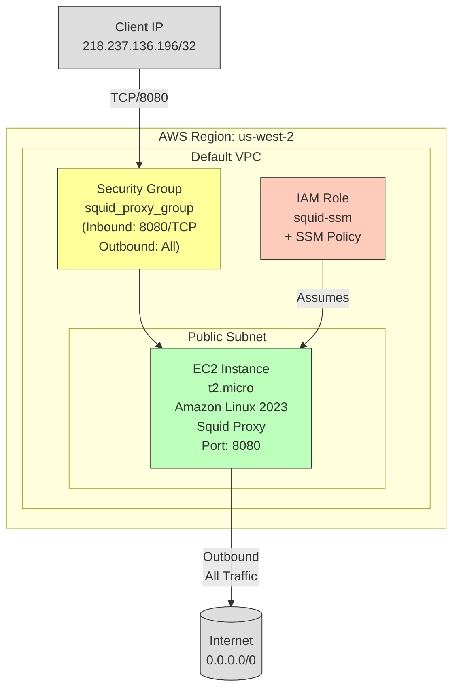

+++
title = 'I’ve been living in Korea since August I need a Proxy Vm'
date = 2024-09-30T15:38:18+09:00
draft = false
+++

I’ve been living in Korea since August. The experience has been fascinating on many levels, though not without its frustrations. One unexpected frustration is the way some websites don't work here. Website owners block access to users from Asian countries. This is usually to filter out bots and scammers, as well as licensing rights that are geographically bounded. I was not able to log into starbucks.com to purchase a gift card because of this. Starbucks in Korea is partially owned by the Shinsegae corporation in Korea, so whenever I tried to log into starbucks.com it simply would not work.

Another thing I was not able to do was watch PBS in Korea. Don't judge me but I've always loved watching boring stuff on PBS. I even donated money to PBS. But in Korea I can’t watch Nova or Frontline.  

Since I’m a “devops” engineer I used my Devops wizardry to solve this regional issue. The simpler solution would be to purchase a VPN service like (Nord, or Express), but that’s $10 dollars a month. That seems like alot of money to buy a starbucks gift card. Instead I could temporarily spin up a proxy server on AWS and the cost to watch some boring show on PBS will be less than 10 cents.



Here's the terraform code to spin up a proxy server on AWS. This will output a public IP address that you can use to access the proxy server. After running this terraform, configure [Firefox](https://support.mozilla.org/en-US/kb/connection-settings-firefox) to use the proxy server.


Use the public IP address and port 8080 to access the proxy server.

```

# Define the region variable
variable "aws_region" {
  description = "The AWS region to deploy resources in"
  type        = string
  default     = "us-west-2"  # You can change this default if needed
}

variable "allowed_ip" {
  description = "The IP address that is allowed to access the Squid proxy"
  type        = string
  default     = "4.2.2.2/32" # Modify this IP to your liking.  Go to http://checkip.amazonaws.com/ and get your public IP address.
}

provider "aws" {
  region = var.aws_region
}

# Fetch the default VPC in the region, you typically do not want to use the default VPC, but for a personal project it's fine.
data "aws_vpc" "default" {
  filter {
    name   = "isDefault"
    values = ["true"]
  }

}

data "aws_subnets" "default_vpc_subnets" {
  filter {
    name   = "vpc-id"
    values = [data.aws_vpc.default.id]
  }

}

# Select the first subnet from the list of subnets
data "aws_subnet" "first" {
  id = data.aws_subnets.default_vpc_subnets.ids[0]
}

# Security Group Resource Blocking all traffic except my IP
resource "aws_security_group" "squid_proxy_group" {
  name        = "squid group"
  description = "squid group"
  vpc_id      = data.aws_vpc.default.id

  ingress {
    description = "Allow inbound traffic on port 8080"
    from_port   = 8080
    to_port     = 8080
    protocol    = "tcp"
    cidr_blocks = [var.allowed_ip]
  }

  egress {
    description = "Allow all outbound traffic"
    from_port   = 0
    to_port     = 0
    protocol    = "-1"
    cidr_blocks = ["0.0.0.0/0"]
  }
}

# IAM Role Resource Create an IAM role allow you to use SSM to manage the proxy server.  Use AWS SSM to manage your ec2 instance, its more secure.
resource "aws_iam_role" "squid_ssm" {
  name               = "squid-ssm"
  description        = "Allows EC2 instances to call AWS services on your behalf."
  assume_role_policy = <<EOF
{
  "Version": "2012-10-17",
  "Statement": [
    {
      "Effect": "Allow",
      "Principal": {
        "Service": "ec2.amazonaws.com"
      },
      "Action": "sts:AssumeRole"
    }
  ]
}
EOF
}

# IAM Instance Profile Resource
resource "aws_iam_instance_profile" "squid_ssm" {
  name = "squid-ssm"
  role = aws_iam_role.squid_ssm.name
}

# IAM Role Policy Attachments
resource "aws_iam_role_policy_attachment" "squid_ssm_ssm_managed_instance_core" {
  role       = aws_iam_role.squid_ssm.name
  policy_arn = "arn:aws:iam::aws:policy/AmazonSSMManagedInstanceCore"
}

# Fetch Amazon Linux 2 AMI
data "aws_ami" "amazon_linux_2" {
  most_recent = true
  owners      = ["amazon"]

  filter {
    name   = "name"
    values = ["al2023-ami-*-x86_64"]
  }

}

# EC2 Instance Resource
resource "aws_instance" "squid_proxy_vm" {
  ami                         = data.aws_ami.amazon_linux_2.id
  instance_type               = "t2.micro"
  subnet_id                   = data.aws_subnet.first.id
  associate_public_ip_address = true
  iam_instance_profile        = aws_iam_instance_profile.squid_ssm.name
  vpc_security_group_ids      = [aws_security_group.squid_proxy_group.id]

  user_data = <<-EOF
    #!/bin/bash
    # Update the system
    yum update -y

    # Install Squid
    yum install squid -y

    # Configure Squid
    cat <<EOT > /etc/squid/squid.conf
    acl allowed_ips src ${var.allowed_ip}
    http_access allow allowed_ips
    http_port 8080
    EOT

    # Start and enable Squid service
    systemctl start squid
    systemctl enable squid

    # Restart Squid to apply the new configuration
    systemctl restart squid
  EOF

  tags = {
    Name = "SquidProxy"
  }

}

output "proxy_vm_public_ip" {
  description = "The public IP address of the EC2 instance"
  value       = aws_instance.squid_proxy_vm.public_ip
}
```
